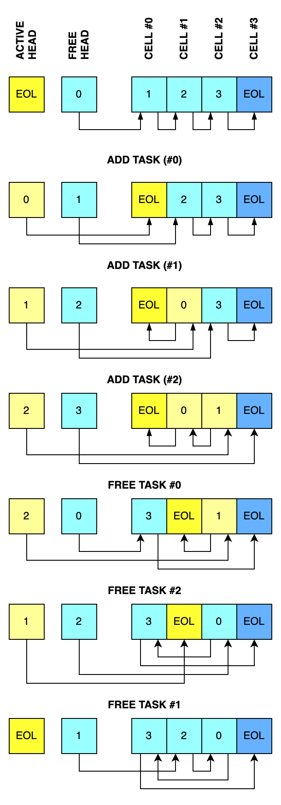

# thi.ng.FixedBufferDualList

## About

Fixed size managed buffer which stores two separate implicitly linked lists of
integer IDs (e.g. resource identifiers) in the same space. Only uses N+2 ints of
configured type. No extra space needed for links between cells. The first list
stores IDs currently in use, the other stores currently available IDs.

Any unsigned int type is supported for IDs. The max. list capacity depends on
that chosen type (e.g. 255 for `u8`, 65535 for `u16`...)



[Diagram context/reference](https://mastodon.thi.ng/@toxi/111449052682849612)

## Example usage

```zig
// define a new dual list type (capacity: 4, value type: u8) and create instance
var list = @import("thi.ng").FixedBufferDualList(4, u8).new();

// obtain next available ID
// (return error if capacity reached)
const id = try list.alloc(); // 0

// release given ID
// (returns error if invalid ID)
try list.free(id);


// iterate over all currently active IDs
var iter = list.iterator();
while (iter.next()) |i| {
    std.debug.print("active: {d}\n", .{i});
}
```
